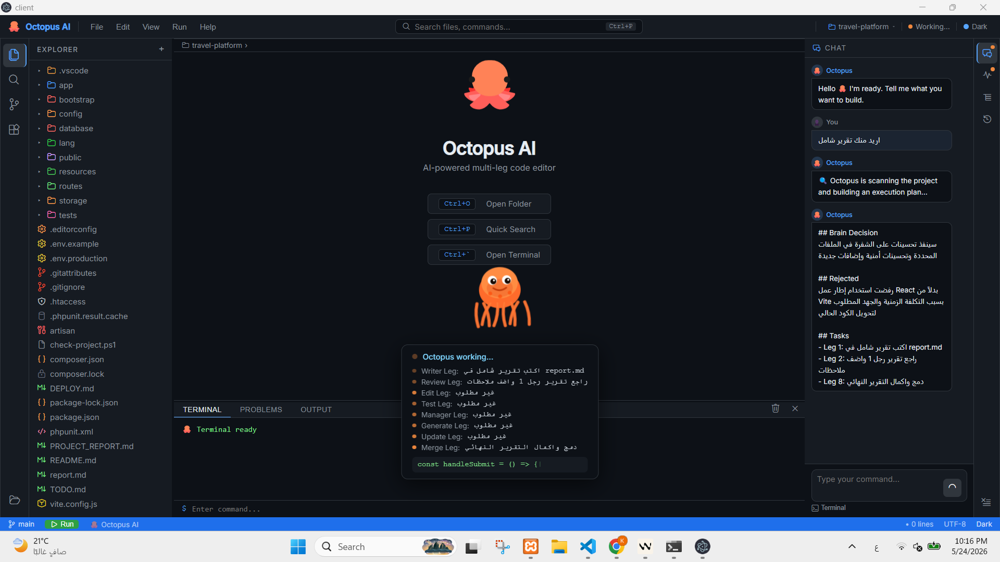
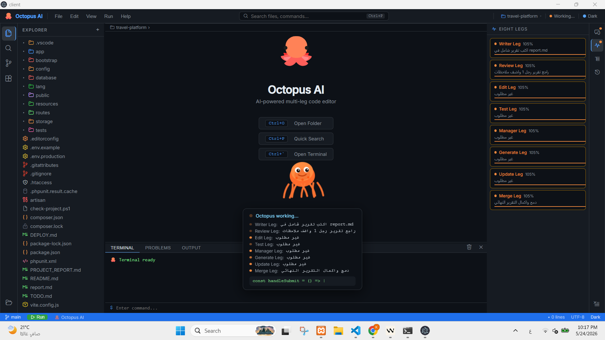

# 🐙 Octopus AI

**AI-powered multi-leg code editor** — an intelligent coding assistant that runs multiple AI agents in parallel, each handling a different aspect of your task simultaneously.

---

## Screenshots





---

## Features

- **8 Parallel AI Legs** — Writer, Review, Edit, Test, Manager, Generate, Update, and Merge legs work simultaneously
- **Brain Controller** — decides which legs are needed and coordinates execution
- **Multi-Provider AI** — supports Groq, OpenRouter, Gemini, Mistral, Cohere, Together AI
- **Plugin System** — extensible plugin marketplace (autocomplete, formatter, linter, and more)
- **Project Map Engine** — scans and understands your entire codebase
- **Supervisor & Truth Layer** — validates and quality-checks AI outputs
- **Real-time Terminal** — built-in terminal with live output

---

## Getting Started

### Prerequisites
- Node.js 18+
- npm or yarn

### Installation

```bash
# Clone the repo
git clone https://github.com/Kozer94/octopus-ai.git
cd octopus-ai

# Install server dependencies
cd server && npm install

# Install client dependencies
cd ../client && npm install
```

### Configuration

Copy `.env.example` to `.env` and add your API keys:

```bash
cp server/.env.example server/.env
```

```env
GROQ_API_KEY=your_key_here
OPENROUTER_API_KEY=your_key_here
GEMINI_API_KEY=your_key_here
MISTRAL_API_KEY=your_key_here
COHERE_API_KEY=your_key_here
TOGETHER_API_KEY=your_key_here
PORT=3001
```

### Run

```bash
# Start the server
cd server && node index.js

# Start the client (in another terminal)
cd client && npm run dev
```

---

## Architecture

```
octopus-ai/
├── server/
│   ├── brainController.js   # Decides which legs to activate
│   ├── supervisor.js        # Orchestrates leg execution
│   ├── truthLayer.js        # Validates AI outputs
│   ├── validatorLayer.js    # Quality checks
│   ├── modelSelector.js     # Multi-provider AI routing
│   ├── projectMapEngine.js  # Codebase scanner
│   ├── routes/              # API endpoints
│   └── plugins/             # Plugin system
└── client/
    └── src/
        └── App.jsx          # Main UI
```

---

## License

MIT
