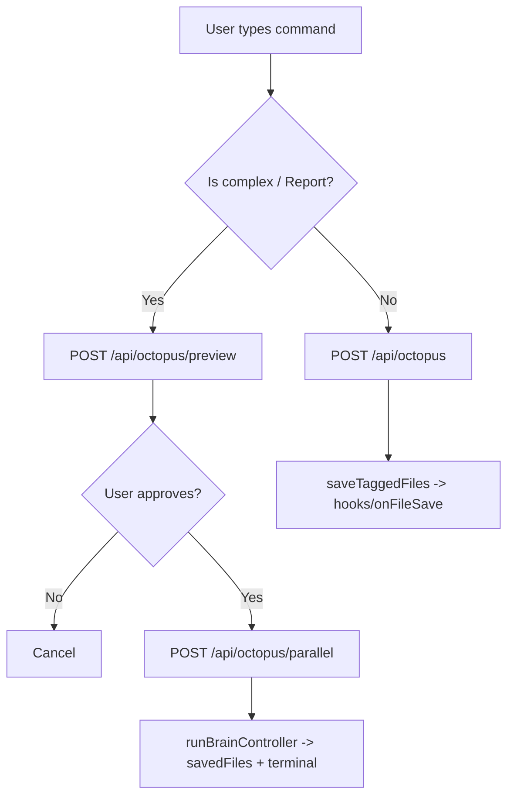

# تقرير شامل عن مشروع **Octopus AI**

> **الهدف:** تقرير هندسي شامل يشرح كل أجزاء مشروع Octopus AI (Client / Server / Electron Main)
> مع **تصاميم** و **وايرفريمات (Wireframes)** للواجهات الرئيسية.

---

## 1) نظرة عامة على المشروع

**Octopus AI** هو تطبيق سطح مكتب (Desktop) مبني على:
- **Electron** لتشغيل واجهة React كـ Desktop App.
- **React + Vite + Monaco Editor** لواجهة تحرير وواجهة دردشة.
- **Express Server** لتوفير API للقراءة/الكتابة/استكشاف الملفات وتشغيل أوامر الطرفية.
- طبقات “ذكاء اصطناعي” (AI Orchestration) داخل السيرفر لتنفيذ أوامر المستخدم عبر **نظام متعدد الأرجل (Eight Legs)**.
- نظام **Plugins** لتوسيع السلوك (hooks) وربط مزودات AI.
- نظام **Marketplace** و **NPM / Open VSX search** لإتاحة تثبيت إضافات.

---

## 2) بنية المشروع (Structure)

المشروع مقسوم إلى 3 أجزاء:

### 2.1 الجذر (Root)
- `main.js` (Electron main entry)
- `preload.js` (bridge آمن بين Electron main و renderer)
- `TODO.md` (مخطط/قائمة مهام)

### 2.2 Client (React)
المسار: `client/`
- `client/src/App.jsx` : نقطة orchestration للواجهة بعد فصل معظم المكونات والـ hooks والخدمات
- `client/src/components/*` : مكونات الواجهة الأساسية (Explorer/Editor/Terminal/Chat/Legs/Context/History/Extensions)
- `client/src/hooks/*` : workflows واختصارات وauto-scroll وterminal approvals
- `client/src/services/*` : API client ومعالجة ملفات Octopus المحفوظة
- `client/src/utils/*` : helpers نقية للـ diff والملفات المفتوحة والرسائل والأرجل والمسارات
- `client/src/main.jsx` : bootstrap لـ React
- `client/src/index.css` و `client/src/App.css`
- `client/public/*`

### 2.3 Server (Express + AI Orchestration)
المسار: `server/`
- `server/index.js` : bootstrap للسيرفر وربط routes والخدمات
- `server/routes/*` : routes منفصلة للملفات/terminal/git/workspace/system/core/marketplace/packages/plugins/octopus
- `server/services/*` : خدمات منفصلة للملفات والطرفية والأمان وAI وJSON state وTODO log وغيرها
- `server/brainController.js` : محرك قرار/تنفيذ متعدد الأرجل (توجد routes preview/parallel)
- `server/projectMapEngine.js` : بناء خريطة المشروع (Project Map) + watcher
- `server/truthLayer.js` : سياق المشروع + بناء state + قراءة/كتابة ملفات منطقيًا
- `server/validatorLayer.js` : validation + حماية من كتابة ملفات حساسة + extraction من tagged output
- `server/modelSelector.js` : اختيار provider/model بناءً على نوع الطلب
- `server/supervisor.js` : تشغيل/إيقاف العمليات الداعمة
- `server/routes/octopus.js` : routes تنفيذ Octopus preview/parallel/chat
- `server/plugins/*` : نظام plugins (basePlugin / pluginManager / hooks …)

---

## 3) Wireframes (تصاميم واجهة) + تدفق الاستخدام

### 3.1 Wireframe: الواجهة الرئيسية (Main Desktop UI)

```text
┌──────────────────────────────────────────────────────────────────────────┐
│ [Activity Bar]  [Top Menu Bar + Quick Search + Project Switcher]     │
│ ────────────────────────────────────────────────────────────────────── │
│                                                                  (EA)  │
│                                                                         │
│  ┌──────────── Sidebar ────────────┐  ┌──────── Right Panel ───────┐ │
│  │ Explorer / Search / Git / Ext   │  │ Chat | Eight Legs | Context │ │
│  │                                 │  │ History                      │ │
│  │  ┌──────── Files Tree ─────┐   │  │  (Approve plan in chat)     │ │
│  │  │ folder/files...         │   │  │                              │ │
│  │  └──────────────────────────┘   │  └────────────────────────────┘ │
│  └─────────────────────────────────┘
│               ┌──────────── Editor ─────────────┐                     │
│               │   Monaco Editor (Code editing)    │                     │
│               └────────────────────────────────────┘                     │
│               ┌────── Terminal (toggle) ────────┐                    │
│               │ output / input command bar      │                     │
│               └──────────────────────────────────┘                     │
└──────────────────────────────────────────────────────────────────────────┘
```

**مكوّنات أساسية داخل `client/src/components`:**
- **Activity Bar** يسار: (Explorer / Search / Git / Extensions)
- **Top Bar** أعلى: قائمة (File/Edit/View/Run/Help) + Quick Search + Switch Projects + Theme selector
- **Sidebar**: تعرض ملفات أو نتائج بحث أو Git status أو Extensions
- **Editor**: Monaco Editor
- **Terminal panel**: عرض output + إدخال أمر
- **Right Panel**: Tabs (Chat / Legs / Context / History)
- **OctopusWorking overlay**: رسوم/أنيميشن مع عرض “Legs” لحالة التنفيذ

---

### 3.2 Wireframe: نافذة Chat + موافقة Plan

```text
┌──────────────────────── Chat Panel ────────────────────────┐
│ Octopus: scanning the project...                           │
│ Octopus: [Preview] Brain Decision / Tasks                 │
│                                                            │
│  ✅ Approve — Execute     |     ❌ Cancel                 │
└─────────────────────────────────────────────────────────────┘
```

التدفق داخل `send()`:
1. إذا الطلب **غير معقد**: يذهب مباشرة لـ `POST /api/octopus`.
2. إذا الطلب **معقد/Report**: يطلب Preview عبر `POST /api/octopus/preview`.
3. تظهر رسالة Approve/Cancel.
4. عند Approve ينفذ parallel عبر `POST /api/octopus/parallel`.

---

### 3.3 Wireframe: Extensions Marketplace (Client UI)

```text
┌──────── Sidebar (Extensions) ────────┐  ┌──────── Editor Area ─────────┐
│ Search extensions...                 │  │ Extension details (preview)  │
│ result cards: [install button]      │  │ tags / description / icon    │
└───────────────────────────────────────┘  │ Install/Uninstall            │
                                            └───────────────────────────────┘
```

**من السيرفر:**
- `GET /api/vsx-search` للبحث في Open VSX.
- `GET /api/vsx-extension/:namespace/:name` لجلب تفاصيل الإضافة.
- `POST /api/extensions/install` و `POST /api/extensions/uninstall` (حاليًا placeholder في السيرفر).

---

## 4) التصميم المعماري (Architecture Design)

### 4.1 تصميم الطبقات (Server-side Layers)

في السيرفر يظهر تصميم طبقات/مسؤوليات:

1. **AI Orchestration / Brain**
   - `brainController.js` يقرر خطة التنفيذ حسب 8 legs.
   - `index.js` يقدم routes:
     - `/api/octopus`
     - `/api/octopus/preview`
     - `/api/octopus/parallel`

2. **Project Map Engine**
   - `projectMapEngine.js` يبني “خريطة المشروع” (sources folders + file graph/context).
   - يوجد watcher عبر `chokidar` لعمل update للخريطة عند تغيرات الملفات.

3. **Truth Layer**
   - يعطي السياق (context) ويجمع معلومات مناسبة للـ task.
   - يتعامل مع قراءة/كتابة محكومة للملفات.

4. **Validator Layer**
   - يحمي من:
     - كتابة ملفات حساسة.
     - path traversal.
     - الكتابة فوق ملفات protected.
   - يدعم استخراج content من output tagged مثل:
     - `<file path="..."> ... </file>`
     - `<terminal> ... </terminal>`

5. **Model Selector**
   - `modelSelector.js` يحدد provider/model المناسب بناءً على نص الأمر.

6. **Plugins System**
   - `server/plugins/pluginManager.js` يدير plugins (class-based).
   - `server/index.js` يتضمن أيضاً “Simple Plugin System” عبر `module.exports` لتوليد hooks/routes.
   - hooks رئيسية تظهر في الكود:
     - `beforeSend`
     - `afterResponse`
     - `onFileSave`

7. **Supervisor**
   - `server/supervisor.js` يدير العمليات/الجلسات (مثل تشغيل watchers/عمليات داعمة).

---

### 4.2 تصميم تدفق “Execution” (مخطط قرار)



---

## 5) نظام “Eight Legs” (تصميم التنفيذ)

### 5.1 تعريف الأرجل (Legs)
داخل `client/src/config/uiConfig.js` وتعرضها الواجهة عبر components/hooks:
- 1 Writer Leg
- 2 Review Leg
- 3 Edit Leg
- 4 Test Leg
- 5 Manager Leg
- 6 Generate Leg
- 7 Update Leg
- 8 Merge Leg

الـ UI يعرض:
- status: idle / working / done
- task
- progress (يتقدم بصرياً)

### 5.2 كيف يتم تمثيلها في السيرفر؟
في `server/routes/octopus.js`:
- route `/api/octopus/parallel` يعتمد على `runBrainController` من `brainController.js`.
- يوجد callback `onUpdate(entry)` ليتعقب مراحل legs.
- النتيجة النهائية تتضمن `plan` و `legResults`.

> ملاحظة: تفاصيل تنفيذ كل leg موجودة فعلياً داخل `server/brainController.js`.

---

## 6) تصميم التعامل مع الملفات (File System Design)

### 6.1 قائمة واجهات الملفات
في السيرفر توجد endpoints رئيسية:
- `POST /api/files/list`
- `POST /api/files/read`
- `POST /api/files/write`
- `POST /api/files/delete`
- `POST /api/files/rename`
- `POST /api/files/show-in-explorer`

### 6.2 حماية السلامة (Safety & Validation)
يوجد حماية متعددة مستويات داخل `server/services/fileService.js` و `server/services/terminalService.js` و `validatorLayer.js`:

**A) Protected files**
- يتم منع الكتابة على ملفات مثل:
  - `package.json`, `package-lock.json`
  - `main.js`, `preload.js`
  - `server/index.js`, `client/src/App.jsx`
  - `.env`

**B) Sensitive patterns**
- منع `.env*`, `.key`, `.pem`, `.p12`…

**C) Path Traversal**
- `isPathSafe(filePath, projectRoot)` للتأكد أن المسار بعد resolve داخل workspace.

---

## 7) تصميم AI Providers + Model Selection

### 7.1 Providers Pool
داخل `server/index.js` يوجد مصفوفة `PROVIDERS`:
- Groq (عدة models)
- Mistral
- Cohere
- Together AI
- OpenRouter
- Gemini

### 7.2 Call AI Logic
وظيفة `callAI(messages, maxTokens, command)`:
1. تستدعي `selectModel(command)` لاختيار model/provider وفق نوع الطلب.
2. تجمع providers من plugins + providers base.
3. تجرب providers بالترتيب مع fallback.
4. تعالج rate limiting (429/quota) لتجربة provider التالي.

---

## 8) Terminal & Execution Design

### 8.1 Terminal endpoints
- `POST /api/terminal`
  - ينفذ الأمر عبر `exec` (shell cmd.exe)
  - مانع أوامر خطرة: `rm -rf`, `del /f /s`, `format`, `shutdown`, `reboot`

- `POST /api/terminal/stream`
  - SSE style / streaming لـ stdout/stderr

### 8.2 Run Project
- `POST /api/run` لتنفيذ أمر مثل:
  - `npm run dev`
  - أو `php artisan serve` إذا وجد `artisan`
  - أو `python manage.py runserver` إذا وجد `manage.py`

- `POST /api/stop` لإيقاف العملية

---

## 9) Project Map Engine & Watcher

### 9.1 الغرض
- بناء “خريطة” للملفات والسياق حسب مشروع المستخدم.
- استعمالها في:
  - اختيار files للسياق
  - تحسين جودة المخرجات من الـ LLM

### 9.2 Watch API
يوجد SSE endpoints:
- `GET /api/watch` للمراقبة.
- `POST /api/watch/start` لبدء `chokidar` scanning.
- `POST /api/watch/stop` للإيقاف.

---

## 10) Plugins & Marketplace Design

### 10.1 PluginManager (Class-based)
داخل `server/plugins/pluginManager.js` يوجد:
- load plugins من directory
- enable/disable
- stats
- getAllAIProviders

### 10.2 Simple Plugin System
في `server/index.js` يوجد plugin system إضافي مبني على:
- `pluginsDir` و `plugins.json` لحفظ حالة enabled
- تحميل ملفات plugins `.js` عبر `require()`
- تسجيل routes تلقائياً بناءً على `plugin.routes`
- hooks عبر `plugin.hooks[hookName]`

### 10.3 Marketplace
`server/plugins/marketplace.js` + routes في `server/index.js`:
- `GET /api/marketplace/plugins`
- `GET /api/marketplace/plugins/:id`
- `GET /api/marketplace/search?q=`
- `GET /api/marketplace/categories`
- `GET /api/marketplace/popular`
- `GET /api/marketplace/top-rated`
- `POST /api/marketplace/install/:id`
- `POST /api/marketplace/uninstall/:id`

---

## 11) Wireframe: حالات التنفيذ (Legs) + Overlay

```text
[OctopusWorking Overlay]
  - دائرة octopus + tentacles anim
  - card صغير يعرض:
      Writer Leg: ...
      Review Leg: ...
      ...
  - typing code animation
```

يتم عرض Overlay فقط عندما `loading === true` (في الكود: `OctopusWorking active={loading}`)

---

## 12) أمثلة على Output Tags (تصميم بروتوكول بين AI و File Writer)

السيرفر يتوقع مخرجات من الـ AI بالشكل:

```xml
<file path="some/path/file.js">
// content
</file>

<terminal>
// terminal commands
</terminal>
```

ثم `saveTaggedFiles()` يقوم بـ:
- parsing regex:
  - `<file path="..."> ... </file>`
- منع protected/sensitive
- كتابة الملفات
- استدعاء hooks `onFileSave`

---

## 13) Security & Safety Checklist (ملخص)

يوجد في الكود:
- rate limiting لـ endpoints العامة و endpoints AI
- protection من writing:
  - ملفات محددة PROTECTED
  - ملفات حساسة (keys/certs/env)
- path traversal protection
- terminal commands blocklist

> توجد مناطق يمكن تحسينها مستقبلاً (مذكورة في TODO.md و يمكن توسيع هذا التقرير):
- auth مضبوط (حالياً لا يوجد JWT/API auth)
- logging/monitoring تفصيلي
- سياسات plugin sandboxing

---

## 14) كيف تشغّل المشروع (Run Instructions)

### 14.1 تشغيل dev (Desktop)
يوجد سكربت في root:
- `npm run dev`

هذا يشغل:
- `client` dev server (vite)
- ثم запуска electron

### 14.2 تشغيل السيرفر/العميل منفصلين
- server: `cd server && npm install && node index.js`
- client: `cd client && npm install && npm run dev`

---

## 15) ما الذي ينبغي إضافته لتقرير “أكثر شمولاً”؟

هذا التقرير اعتمد على قراءة ملفات أساسية (مثل `server/index.js` و `client/src/App.jsx` و `main.js`).

لزيادة الشمول 100% يمكن أيضاً:
- فتح محتوى:
  - `server/brainController.js`
  - `server/projectMapEngine.js`
  - `server/truthLayer.js`
  - `server/validatorLayer.js`
  - `server/plugins/*`
- ثم إضافة:
  - UML sequence diagrams لكل leg
  - جدول واضح لكل API endpoint (request/response schema)
  - وثائق proto للتاجز `<file>`, `<terminal>`

---

## 16) خاتمة

Octopus AI يقدم تجربة Desktop Coding Assistant عبر:
- واجهة React/Monaco
- server orchestrator ينفذ خطط AI متعددة الأرجل
- حماية قوية من الوصول/الكتابة غير الآمنة نسبيًا
- قابلية توسيع عبر Plugins و Marketplace

---

# ملحق A: مخطط سريع لواجهات Client المنطقية (UI Components)

- `FileTreeNode`: شجرة ملفات
- `OctopusWorking`: Overlay أثناء العمل
- `TypingCode`: عنصر كتابة متحركة
- Editor + Terminal + Right Panel Tabs

---

# ملحق B: مخطط API Endpoints (مختصر)

- AI:
  - `POST /api/octopus`
  - `POST /api/octopus/preview`
  - `POST /api/octopus/parallel`

- Files:
  - `POST /api/files/list`
  - `POST /api/files/read`
  - `POST /api/files/write`
  - `POST /api/files/delete`
  - `POST /api/files/rename`
  - `POST /api/files/show-in-explorer`

- Terminal:
  - `POST /api/terminal`
  - `POST /api/terminal/stream`
  - `POST /api/run`
  - `POST /api/stop`

- Git:
  - `POST /api/git/status`
  - `POST /api/git/commit`
  - `POST /api/git/diff`

- Search:
  - `POST /api/search`

- Watch:
  - `GET /api/watch`
  - `POST /api/watch/start`
  - `POST /api/watch/stop`

- Plugins/Marketplace:
  - `GET/POST /api/plugins/*`
  - `GET/POST /api/marketplace/*`
  - `GET/POST /api/vsx-search`


